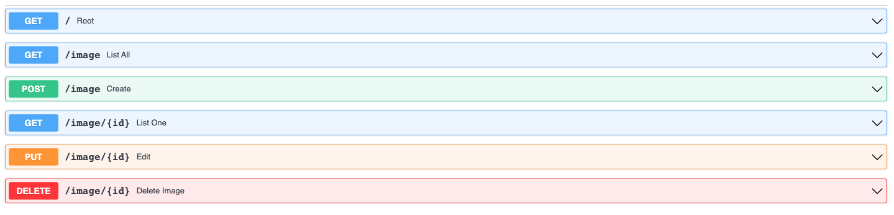

# IMAGES REPOSITORY PROJECT
This project was built to allow the management of a collection of images. 

Is designed under the following criteria:
- Rapid microservices development and delivery,
- Separate logic for back-end and front-end,
- Single responsibility.

## Technologies
The following technologies are included in this project:
- A MySQL database implemented through mysqlAlchemy,
- Cloudinary to manage the inserted images, 
- The FastAPI micro-framework for the back-end fucntionalities,
- Swagger UI that automatically generates documentation that allows to view and interacting with API methods,
- Coverage to execute test in an automated way,
- The React framework for the front-end functions.

## Getting Started
These instructions will give you a complete functional environment of the project. 
This is a guide on how to install. You can adapt it to your operating system and/or your specific needs.

### Prerequisites
This project has some requirements that must be fulfilled before starting the installation:
- Python 3.9,
- Node 18.9.0,
- Pip 21.3.1,
- Cloudinary account,
- MySQL (phpMyAdmin is a good option),
- Install libraries dependencies (python requirements.txt and react package.json),
- Configure your Environment variables,
- Running the tests.

## Create Cloudinary account
Create a account in cloudinary webpage https://cloudinary.com/. 
Once you have it, go to the dashboard section and write down the following values to configure the environment variables (next step)
- Cloud Name,
- API Key,
- API Secret.

## Environment variables
Make sure you have modified the environment variables into images_back_app/config/constants.py to:
- Connect to the MySQL Database
- Connect to Cloudinary

## Running the MySQL
Make sure that you have the service for the database running.
You do not need to create any database manually, as the service already does it for you.

## Install The Python requirements.txt
From the terminal open the images_back_app folder. 
If you used to, you can create a virtual environment and activate it to install the dependencies of this project, follow the instructions in https://docs.python.org/es/3/library/venv.html, it always is a good practice.

Finally run the requirements.txt file, executing the following command:
```shell
pip install -r requirements.txt
```

## Running the FastAPI Application
You now have the back-end environment ready to launch the service, so still inside the images_back_app folder
from the terminal run the main.py file, executing the following command:
```shell
uvicorn main:app --reload 
```
Remember that when you run it you can go to query your MySQL database to see if the database and table were created successfully.

Now go to the end-point and start to using the API http://127.0.0.1:8000/docs#.



Please don't close the service.

## Running the React application
From another terminal, open the images_front_app folder. 
Execute the following command in order to installate the dependencies ot the local node_modules:
```shell
npm install
```
In the same terminal and same folder, execute the following command to launch the application service:
```shell
npm start
```
Now go to the end-point and start to using the front http://localhost:3000/.


## Running the tests
All the functions of the project have associated unit tests to verify that everything works correctly. These tests can be executed in several ways:
- By going to the test file and running them one by one.
- Or through the coverage library:
  - Install `coverage` library and use it to run the tests:
```shell
pip install coverage
```
```shell
coverage run -m unittest discover
```
  - To obtain the test and coverage reports execute:
```shell
coverage report
```
